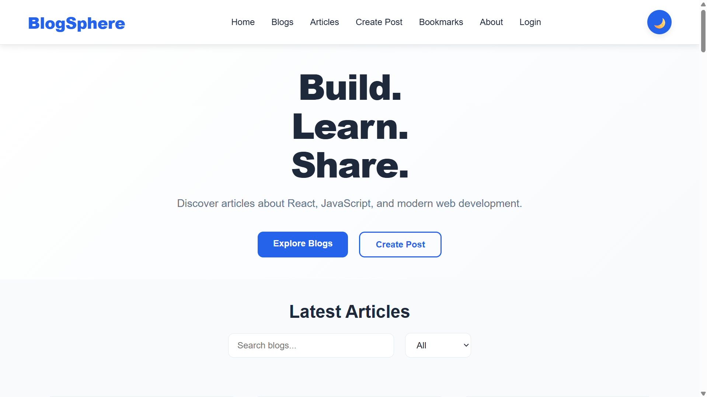
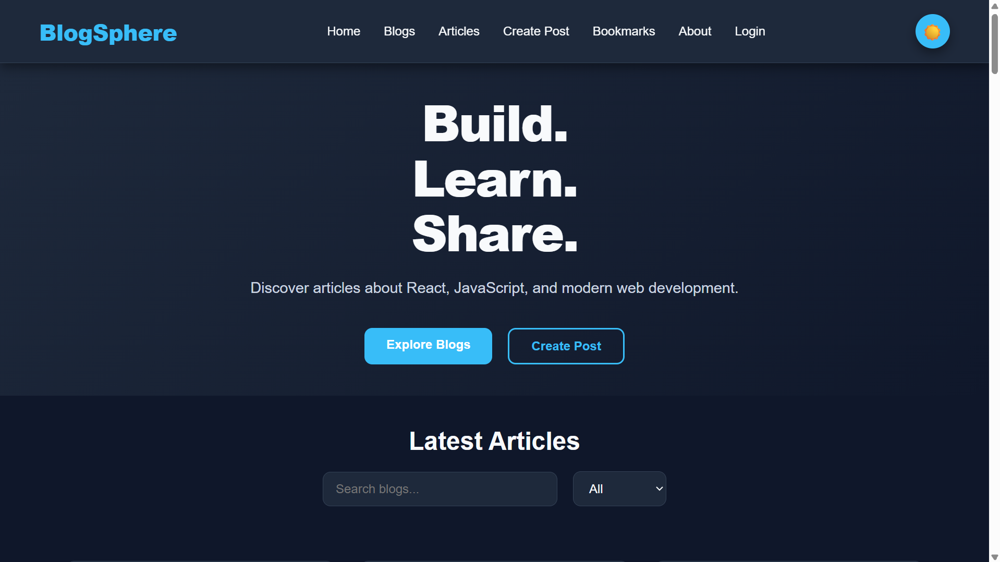
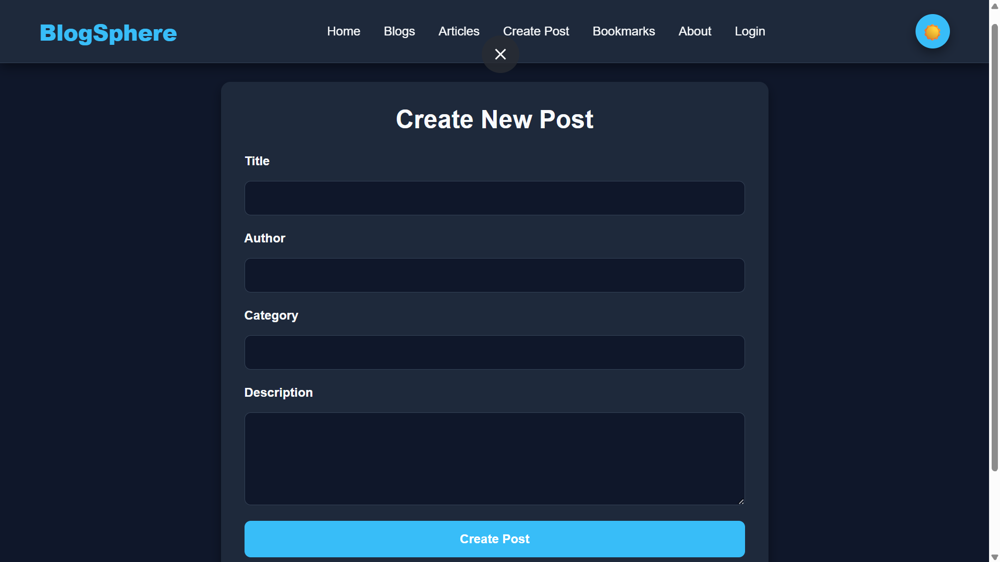
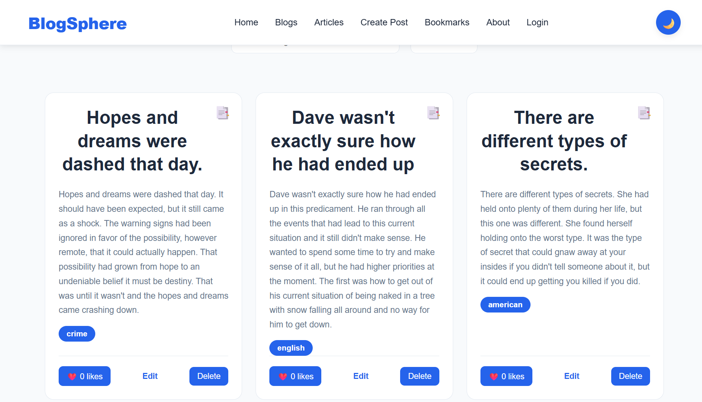
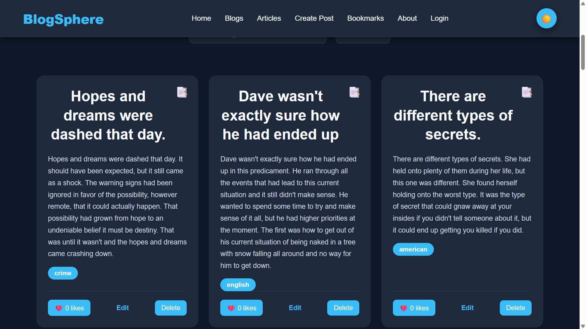

# 🌐 BlogSphere – Modern React Blog Platform

BlogSphere is a modern, responsive blogging application built with React. It allows users to explore articles, read detailed blog posts, create and manage their own posts, bookmark favorite articles, and personalize their experience with a complete light/dark theme system.

This project was built step-by-step while learning React concepts and transforming a simple blog application into a more complete and scalable platform.

---

# ✨ Features

## 📚 Blog Experience

- Browse blog posts fetched from the DummyJSON API
- View complete blog details
- Display related comments
- Dynamic categories and tags
- Search blog posts
- Filter posts by category

## ✍️ Post Management

- Create new blog posts
- Edit existing posts
- Delete posts
- Form validation
- Local storage persistence

## 🔖 Bookmark System

- Bookmark favorite articles
- Manage saved posts
- Global state management using Jotai
- Persistent bookmarks with localStorage

## 🎨 User Interface

- Modern responsive design
- Mobile-friendly layout
- Hero section
- Reusable blog cards
- Professional navigation bar
- Footer section

## 🌙 Dark Mode

- Complete light/dark theme support
- Theme management using React Context API
- Theme preference saved using localStorage
- Smooth theme transitions

---

# 📸 Screenshots

# 📸 Screenshots

## 🏠 Home Page (Light Mode)



## 🌙 Home Page (Dark Mode)



## ✍️ Create Post



## 📚 Blog Feed



## 📚 Blog Feed (Light Mode)



---

# 🛠️ Tech Stack

## Frontend

- React
- Vite
- CSS3

## Libraries

- React Router DOM
- Jotai
- Context API

## Other Tools

- DummyJSON REST API
- Local Storage

---

# 📂 Project Structure

```text
blog-app/
│
├── screenshots/
│   ├── home-light.png
│   ├── home-dark.png
│   ├── blog-feed-light.png
│   ├── create-post.png
│   └── blog-feed.png
│
├── src/
│   │
│   ├── atoms/
│   │   └── bookmarkAtoms.js
│   │
│   ├── components/
│   │   ├── Navbar.jsx
│   │   ├── Footer.jsx
│   │   ├── BlogCard.jsx
│   │   └── BlogForm.jsx
│   │
│   ├── context/
│   │   └── ThemeContext.jsx
│   │
│   ├── hooks/
│   │   └── useFetchPosts.js
│   │
│   ├── pages/
│   │   ├── Home.jsx
│   │   ├── Blogs.jsx
│   │   ├── BlogDetails.jsx
│   │   ├── Articles.jsx
│   │   ├── CreatePost.jsx
│   │   ├── EditPost.jsx
│   │   ├── Bookmarks.jsx
│   │   ├── About.jsx
│   │   └── Login.jsx
│   │
│   ├── data/
│   │
│   ├── styles/
│   │
│   ├── App.jsx
│   └── main.jsx
│
├── package.json
├── vite.config.js
└── README.md
```

---

# 🚀 Getting Started

## Clone the repository

```bash
git clone https://github.com/ibnumohammed99/react-final-project-blog-app.git
```

## Navigate to the project

```bash
cd react-final-project-blog-app
```

## Install dependencies

```bash
npm install
```

## Start development server

```bash
npm run dev
```

The application will run at:

```
http://localhost:5173
```

---

# 🌐 API

BlogSphere uses the free DummyJSON API.

## Get Posts

```
https://dummyjson.com/posts
```

## Get Single Post

```
https://dummyjson.com/posts/{id}
```

## Get Comments

```
https://dummyjson.com/comments/post/{id}
```

---

# 📚 What I Learned

This project helped me improve my skills in:

- Building scalable React applications
- Component-based architecture
- React Router navigation
- State management with Jotai
- Theme management with Context API
- REST API integration
- CRUD operations
- Form validation
- Local storage usage
- Responsive UI development
- Organizing a production-style React project

---

# 🚀 Future Improvements

- User authentication system
- Backend integration
- Database storage
- Rich text editor
- User profiles
- Real-time comments
- Advanced search
- Admin dashboard

---

# 👨‍💻 Author

**Miftahudin Mohammed**

GitHub:
https://github.com/ibnumohammed99

---

⭐ If you like this project, consider giving it a star!
